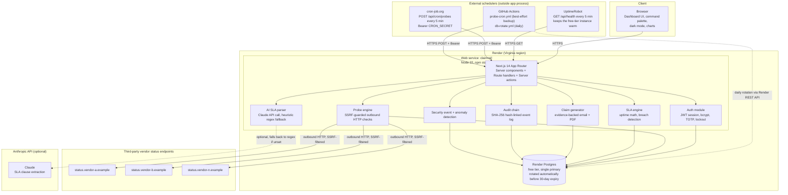
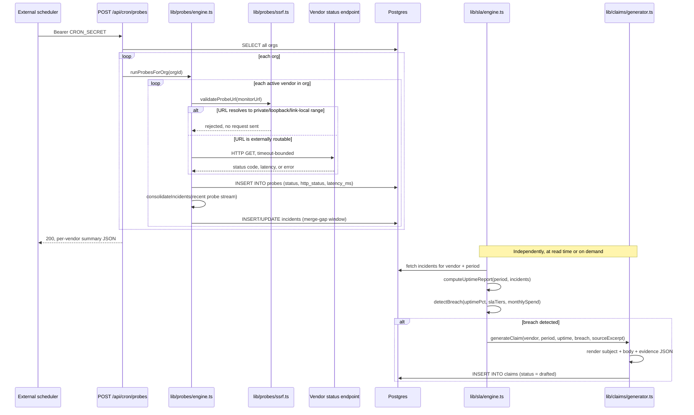
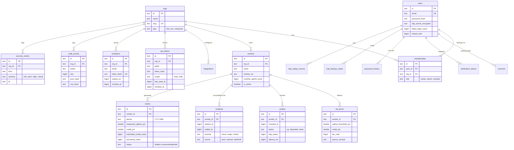
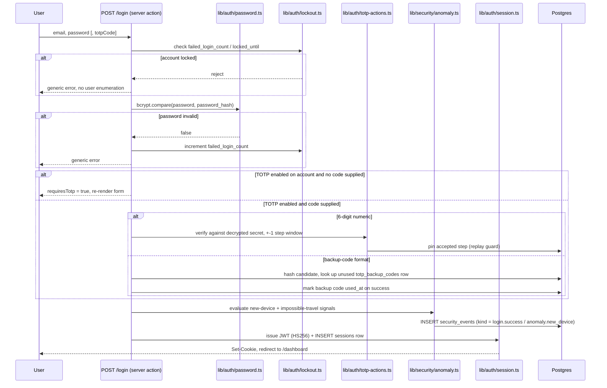
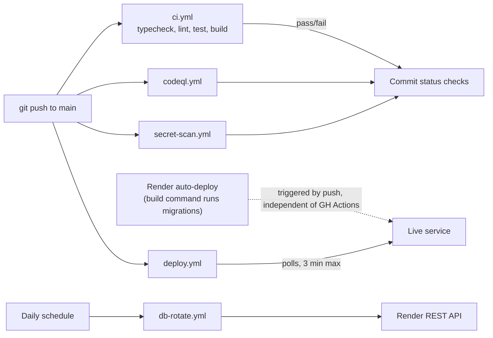
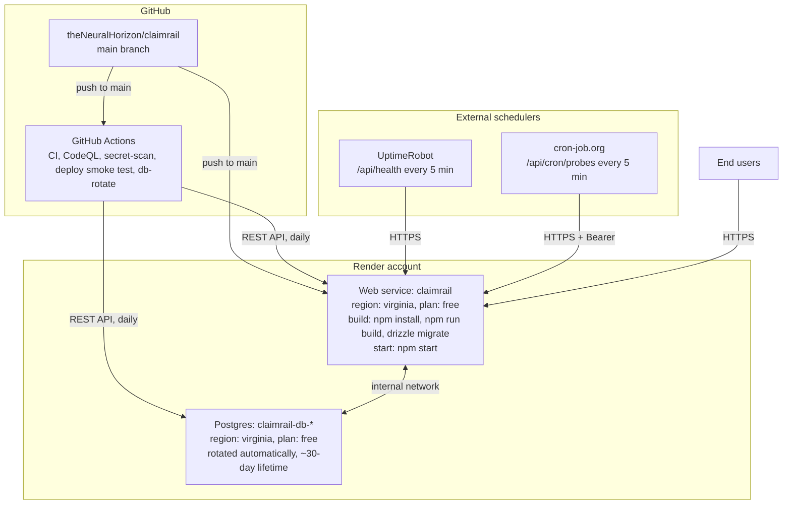

# ClaimRail

Full-stack B2B SaaS platform that monitors third-party vendor uptime independently of vendor-published status pages, computes measured uptime against parsed contractual SLA terms, detects breaches, and generates evidence-backed service-credit claim letters.

**Live deployment:** https://claimrail-tj98.onrender.com
**Demo credentials:** `demo@claimrail.io` / `DemoRail!2026`
**Repository:** https://github.com/theNeuralHorizon/claimrail
**License:** MIT

[](https://github.com/theNeuralHorizon/claimrail/actions/workflows/ci.yml)
[](https://github.com/theNeuralHorizon/claimrail/actions/workflows/codeql.yml)
[](https://github.com/theNeuralHorizon/claimrail/actions/workflows/deploy.yml)
[](LICENSE)

---

## Table of contents

1. [Problem statement](#problem-statement)
2. [System architecture](#system-architecture)
3. [Data flow: probe to claim](#data-flow-probe-to-claim)
4. [Data model](#data-model)
5. [Authentication and session architecture](#authentication-and-session-architecture)
6. [Security architecture](#security-architecture)
7. [Feature inventory](#feature-inventory)
8. [Technology stack](#technology-stack)
9. [Repository layout](#repository-layout)
10. [CI/CD pipeline](#cicd-pipeline)
11. [Production deployment topology](#production-deployment-topology)
12. [Local development](#local-development)
13. [Environment variables](#environment-variables)
14. [REST API v1](#rest-api-v1)
15. [Testing](#testing)
16. [Known limitations](#known-limitations)
17. [Design decisions and rationale](#design-decisions-and-rationale)
18. [License](#license)

---

## Problem statement

Mid-market and enterprise organizations run 30 to 100+ SaaS vendors, collectively representing several million dollars a year in spend. The majority of these contracts include a service-level agreement (SLA) clause that entitles the customer to a service credit when the vendor's measured uptime for a billing period falls below a contractual threshold — typically tiered (for example, below 99.9 percent yields a 10 percent credit, below 99.0 percent yields 25 percent, and so on).

In practice, these credits go unclaimed almost universally, for four structural reasons:

- **Measurement asymmetry.** The vendor's own status page is the only commonly available uptime record, and the vendor has no incentive to report outages accurately or completely.
- **Operational overhead.** Tracking dozens of SLA clauses, each worded differently, against actual measured uptime, and filing a claim within a 14 to 30 day contractual window, is not a task any team owns by default.
- **Evidence burden.** A credible claim requires incident timestamps, durations, and a citation of the specific contractual clause breached — assembling this by hand does not scale past a handful of vendors.
- **No single source of truth.** Nothing sits between "vendor's SLA document" and "vendor's own status page" that independently measures and adjudicates.

ClaimRail is built to close that loop end to end: ingest the SLA text, monitor independently, compute breaches deterministically, and produce a claim ready to send.

## System architecture

The system is a single Next.js application (App Router, server components and server actions) backed by a Postgres database, deployed as one process on Render. There is no separate backend service — API routes, server actions, and server-rendered pages all run inside the same Node.js process. External uptime monitoring for vendors is performed by outbound HTTP probes issued from that same process, triggered by an inbound authenticated cron call rather than an internal scheduler, because the hosting platform does not provide one on its free tier.



Two properties of this topology are load-bearing and worth stating explicitly:

- **The scheduler lives outside the application.** `/api/cron/probes` is a plain authenticated HTTP endpoint. Anything capable of an HTTPS POST with the right bearer token can drive it — GitHub Actions, cron-job.org, Vercel Cron, an EventBridge rule, or a developer's own crontab. This was a deliberate choice: it costs nothing on a free hosting tier and does not depend on the platform offering background workers.
- **The database is disposable by design.** Render's free Postgres plan deletes the instance 30 days after creation with no warning. Rather than treat that as an outage to react to, the repository ships automation (`scripts/rotate-db.mjs`, described in [Production deployment topology](#production-deployment-topology)) that detects the approaching expiry and replaces the instance before it happens.

## Data flow: probe to claim

The core value of the product is a pipeline that turns a raw HTTP probe result into a dollar figure a vendor can be billed for. Each stage is a small, independently unit-tested pure function or module, deliberately kept free of side effects where possible so the math can be verified in isolation from the database and network.



Three points about this pipeline are not obvious from the diagram alone:

- **Incident consolidation, not raw probe display.** A vendor flapping between `up` and `down` every probe interval would otherwise produce dozens of one-shot "incidents." `consolidateIncidents` merges probe failures separated by less than a configurable gap (default 30 minutes) into a single incident window, which is what actually gets cited in a claim letter.
- **Uptime math is period-boundary safe.** An incident that starts on the last day of one month and ends on the first day of the next is split proportionally across both billing periods rather than attributed wholly to one, because that is how a vendor's own SLA accounting would treat it and a claim that gets this wrong is trivially disputable.
- **Credit tier selection picks the most generous applicable tier, not the sum.** A real SLA with tiers at 99.9 percent to 10 percent and 99.0 percent to 25 percent awards 25 percent — not 35 percent — if uptime falls below 99.0 percent. This is a common correctness bug in naive implementations and is covered directly by the SLA engine's test suite.

## Data model

Every table below is scoped by `org_id` except the tables that are themselves scoped indirectly through a foreign key chain (for example, `sla_terms` scopes through `vendor_id` to `vendors.org_id`). Multi-tenant isolation is enforced at the query layer — every read and write in `lib/queries.ts` and the server actions takes the caller's `orgId` from the authenticated session and includes it in the `WHERE` clause; there is no row-level security policy at the Postgres level.



All timestamps in the schema are stored as `bigint` unix-seconds rather than a native Postgres `timestamp` type. This is a deliberate, documented tradeoff (see the header comment in `lib/db/schema.ts`): the audit log's hash chain canonicalizes an integer second, and drift into fractional milliseconds would break hash verification across a schema or driver change; every other call site in the codebase already standardized on `Math.floor(Date.now() / 1000)`.

## Authentication and session architecture

Authentication is custom-built rather than delegated to a third-party auth provider: password hashing via bcrypt, session issuance as a signed JWT (via `jose`, algorithm pinned to HS256), and an optional TOTP second factor with single-use backup codes. Sessions are backed by a database row specifically so they can be revoked — a bare JWT cannot be invalidated before its expiry without a server-side denylist, which is exactly what the `sessions` table is.



Password and account-recovery specifics:

- **Password hashing** uses bcrypt via `bcryptjs`, with a history table (`password_history`) that blocks reuse of the current password and the last N passwords on change.
- **Lockout** increments a per-user failure counter and locks the account for a fixed window past a threshold, independent of IP — this is deliberately account-scoped rather than IP-scoped so a distributed credential-stuffing attempt is still throttled.
- **2FA (TOTP)** follows RFC 6238: a base32 secret is generated, displayed as both a scannable `otpauth://` URI and a manual-entry string, and the user must submit one valid current code to activate it. Accepted codes are pinned to their time step in `totp_replay_nonces` so the same 6-digit code cannot be replayed within its acceptance window.
- **Backup codes** are 10 single-use recovery codes issued at 2FA activation, hashed with the same HMAC digest function used for API tokens, and each is deleted from further use (marked `used_at`) the instant it succeeds. The login form accepts either a 6-digit TOTP code or a backup code in the same input field, distinguished server-side by a `/^\d{6}$/` pattern test.
- **Account-recovery tokens** (email verification, password reset) are single-use, hashed at rest, and expire on a fixed TTL.

## Security architecture

Security controls are organized as independent, individually testable modules under `lib/security/`, rather than as a single monolithic middleware. Each targets a specific class of risk observed during development or explicitly called out as a defense-in-depth measure:

| Module | Threat addressed | Mechanism |
|---|---|---|
| `lib/probes/ssrf.ts` | Server-side request forgery via a user-supplied "monitor URL" pointed at internal infrastructure | Blocks loopback, RFC 1918 private ranges, link-local (including the `169.254.169.254` cloud metadata address), IPv6 ULA/link-local, and `.internal` / `.local` suffixes before the outbound probe request is issued |
| `lib/security/anomaly.ts` | Account takeover going unnoticed | Zero-dependency new-device and impossible-travel heuristics (UA+IP fingerprint history, IP-prefix distance proxy) that write high-signal `security_events` rows for a human to review, deliberately tuned to prefer false positives over false negatives |
| `lib/audit/chain.ts` | Undetected tampering with the audit trail (by an attacker with database access, or an insider) | Every audit row's `row_hash` is `sha256(canonical(fields) || prev_row_hash)`, per-organization, ordered by a strictly monotonic sequence number rather than wall-clock time; the settings UI exposes a one-click chain-integrity verification that recomputes the whole chain |
| `lib/security/crypto.ts` | Secrets at rest (Slack webhook URLs, TOTP secrets) | AES-256-GCM envelope encryption under a key derived from `AUTH_SECRET`; API tokens and backup codes are never stored in recoverable form, only as peppered HMAC-SHA256 digests |
| `lib/security/freeze.ts` | Prototype-pollution payloads reaching application logic | A surgical guard on `Object.prototype.__proto__`'s setter and `constructor` writability, applied at process boot — narrower than a blanket `Object.freeze(Object.prototype)`, which was tried first and broke `postgres-js` in production (documented in `lib/security/freeze.ts` and the corresponding fix commit) |
| `lib/rate-limit.ts` | Brute force and API abuse | In-memory sliding-window limiter keyed per-identity (per-token for the REST API at 60 req/min read and 30 req/min write, per-user for the TOTP verification step at 10 attempts per 10 minutes) |
| `lib/security/redos-guard.ts` | Catastrophic backtracking from user-controlled input reaching a regex (notably the AI SLA parser's fallback path) | Bounds input length and applies a timeout-guarded execution path before user text reaches any regular expression |
| `lib/security/body-limit.ts` | Request body-size denial of service | Hard caps request body size ahead of JSON parsing |
| `lib/security/kill-switch.ts` | Needing to pause a specific subsystem (login, signup, an integration) without a redeploy during an incident | Reads a comma-separated `CLAIMRAIL_DISABLE` environment variable and short-circuits the named routes |
| `lib/security/request-guard.ts` / `lib/security/error-scrub.ts` | Internal error detail (stack traces, connection strings, file paths) leaking to API responses | Centralizes error handling so unhandled exceptions return a generic message to the client while the full detail is server-logged |

Additional controls that sit outside `lib/security/` proper:

- **Content-Security-Policy with a per-request nonce.** Middleware issues a fresh nonce on every request and threads it into both the CSP header and Next.js's streaming inline scripts (`x-nonce` request header, matching Next's own convention), rather than a static policy. Pages that depend on this are forced into dynamic rendering (`headers()` is read in the root layout) since a statically prerendered page cannot carry a per-request value — this was the fix for a production incident where cached static HTML served a stale nonce and the browser blocked every inline script.
- **Multi-tenant isolation** is enforced by convention at the query layer: every server action and API route derives `orgId` from the authenticated session and scopes all reads and writes to it. There is a dedicated test suite (`tests/tenant-isolation.test.ts`, `tests/idor-fuzz.test.ts`) that fuzzes resource IDs across organizations to catch a missing scope check.
- **API token design.** Tokens are generated as `crt_<24-byte-random>`, displayed once at creation, and stored only as an HMAC-SHA256 digest with a 12-character prefix retained in the clear so the UI can render `crt_abc123…` without ever holding the secret. Revocation sets a `revoked_at` timestamp rather than deleting the row, preserving the row for audit purposes while `resolveApiToken` treats any non-null `revoked_at` as invalid.
- **Secret scanning.** A dedicated CI workflow (`secret-scan.yml`, using gitleaks) runs on every push and pull request, independent of the main CI pipeline, to catch a committed credential before it reaches `main`.
- **CodeQL static analysis** runs on every push, every pull request, and weekly on a schedule, covering the JavaScript/TypeScript query pack.

## Feature inventory

### Vendor and SLA management

- Add a vendor with name, monitor URL, monthly spend, and contact email.
- Paste the raw "service credits" clause from a contract and parse it into structured tiers via the AI parser (Claude API) with a heuristic regex fallback that requires no API key.
- Manually add, edit, or remove SLA tiers if the parse needs correction.
- Trigger an on-demand probe from the vendor detail page in addition to the scheduled cadence.
- Per-vendor latency chart (last 30 days) and 7-day uptime sparkline.

### Monitoring and incident detection

- Independent outbound HTTP probing on a schedule driven by an external caller (not vendor-reported status).
- Automatic incident consolidation from the raw probe stream, with a configurable merge-gap window so flapping does not produce noise.
- Severity classification (minor, major, critical) derived from incident duration and failed-probe count.
- Global incident log across all vendors, sorted by recency.

### Claims and recovery

- Automatic breach detection against the correct (most generous applicable) SLA tier, computed per billing period with correct handling of incidents that straddle a month boundary.
- Auto-drafted claim email with a full evidence block: measurement summary, incident log with UTC timestamps, and the exact contractual clause text cited.
- One-click PDF export of the claim (zero-dependency PDF 1.4 writer — no headless-browser or third-party rendering service in the request path).
- `mailto:` deep link pre-filled with subject and body for one-click send from the user's own mail client.
- Status lifecycle: `drafted -> filed -> acknowledged -> recovered` or `rejected`, with an amount-recovered field that can differ from the original estimate.
- Dashboard-level recovery funnel chart (drafted vs. filed vs. recovered, trailing six months) and year-to-date recovered total.

### Authentication, authorization, and account security

- Email/password authentication with bcrypt hashing and account lockout after repeated failures.
- Optional TOTP two-factor authentication (RFC 6238), QR-code and manual-entry secret provisioning, and 10 single-use backup codes.
- Password history enforcement (blocks reuse of recent passwords).
- Session revocation ("sign out of all devices") backed by a database session table, not a stateless-only JWT.
- Role-based access within an organization: owner, admin, member.
- Email invitations with a 7-day single-use link, revocable before acceptance.
- Hash-chained audit log with a UI that reports chain integrity ("N events verified via hash chain") and a live security-events feed with per-severity counters, distinct from the audit log (audit records successful state changes; security events record anomalies and adversarial signals).

### Integrations and API

- REST API v1 (`/api/v1/vendors`, `/api/v1/claims`) authenticated by bearer token with independent read/write scopes and per-token rate limiting.
- OpenAPI 3.1 specification served live at `/api/openapi.json`, with a human-readable reference page at `/api-docs`.
- Slack webhook integration, URL encrypted at rest, firing on claim drafts, SLA breaches, and impossible-travel login detections.
- A single authenticated cron endpoint (`/api/cron/probes`) designed to be driven by whatever scheduler the operator already trusts.

### Operations and UX

- Public `/status` page exposing the same live checks as `/api/health`, auto-refreshing every 30 seconds, with no authentication required.
- `/api/health` liveness endpoint checking database connectivity, core table counts, and probe-cron freshness (flags unhealthy if no probe has run in over an hour), returning HTTP 503 when any check fails.
- Command palette (`Cmd+K` / `Ctrl+K`) with fuzzy search across vendors, claims, and static pages.
- Dark mode with system-preference detection and a manual toggle, using CSS custom properties rather than a class-per-component approach.
- Live notification bell backed by the security-event stream.
- Onboarding checklist for new organizations that tracks completion across setup steps and dismisses itself.
- Kill switch (`CLAIMRAIL_DISABLE` environment variable) to pause named subsystems (for example, `login,signup`) without a redeploy, for incident response.

## Technology stack

| Layer | Choice | Notes |
|---|---|---|
| Framework | Next.js 14 (App Router) | Server components, server actions, and API route handlers in one process; no separate backend |
| Language | TypeScript, strict mode | |
| Database (production) | PostgreSQL, via Render managed Postgres | Free-tier instance, auto-rotated before its 30-day expiry (see below) |
| Database (local, CI, tests) | PGlite (`@electric-sql/pglite`) | An embedded, WASM-based Postgres-compatible engine — zero external service required for `npm run dev` or the test suite; the same Drizzle schema targets both drivers |
| ORM | Drizzle ORM | `drizzle-orm/postgres-js` in production, `drizzle-orm/pglite` locally, selected at runtime by `lib/db/client.ts` based on the shape of `DATABASE_URL` |
| Postgres driver | `postgres` (postgres-js) | TLS enabled automatically when the connection string targets a `.render.com` or `.neon.tech` host |
| Authentication | Custom — `jose` (JWT, HS256) + `bcryptjs` | No third-party auth-as-a-service dependency |
| Validation | Zod | Schema-first request validation on every mutating route |
| Styling | Tailwind CSS + `class-variance-authority` | Utility-first with typed component variants |
| Icons | lucide-react | |
| Charts | Recharts | Uptime sparklines, latency chart, recovery funnel |
| AI (optional) | Anthropic Claude API | SLA clause extraction; the app is fully functional without an API key via the regex fallback parser |
| Testing | Vitest | 181 tests across 24 files at time of writing; unit-level coverage of the SLA engine, probe engine, claim generator, auth flows, and security modules |
| Hosting | Render | Single Node web service, free-tier managed Postgres, free-tier static build cache |
| CI/CD | GitHub Actions | Seven workflows — see [CI/CD pipeline](#cicd-pipeline) |

## Repository layout

```
app/
  (auth)/                  Public auth pages sharing one layout
    login/                 Email + password + conditional TOTP step
    signup/
    forgot-password/
    reset-password/
  (dashboard)/              Authenticated app shell (session-gated layout)
    dashboard/
      page.tsx              Overview: credit-owed summary, uptime, recovery funnel, recent incidents
      vendors/               List, detail (latency chart, incidents, SLA tiers, claims), new (AI SLA parse form)
      incidents/              Global incident log
      claims/                 List, detail (draft letter, status transitions, PDF/email export)
      settings/                Org, account, password, 2FA, audit log, security events, team, Slack, API tokens
  accept-invite/            Invitation acceptance flow
  verify-email/             Email verification flow
  api/
    v1/                     Public REST API (vendors, claims) - bearer token auth
    vendors/                 Internal CRUD + parse-sla + probe + claim actions (session auth)
    claims/[claimId]/         Status transitions, PDF export
    cron/probes/              Shared-secret-authenticated scheduled probing entry point
    health/                   Liveness/readiness endpoint
    notifications/            Security-event feed for the notification bell
    openapi.json/              Generated OpenAPI 3.1 document
    palette/                   Command palette search index
    security/csp-report/        CSP violation report receiver
  api-docs/                 Human-readable API reference (renders the OpenAPI document)
  status/                   Public status page
  privacy/, terms/          Static legal pages
  page.tsx                  Marketing landing page

lib/
  sla/engine.ts              Uptime computation, breach detection, incident consolidation - pure functions, fully unit tested
  probes/engine.ts            HTTP probe execution + incident reconciliation
  probes/ssrf.ts               Outbound URL validation (SSRF guard)
  ai/sla-parser.ts             Claude API call + heuristic regex fallback
  claims/generator.ts          Evidence-backed claim email generation
  claims/pdf.ts                 Zero-dependency PDF 1.4 writer
  auth/                       Password, session (JWT), lockout, password history, TOTP, invitations, API tokens, email
  audit/chain.ts               Hash-chained audit event writer + verifier
  security/                  SSRF guard aside, see the Security architecture table above
  integrations/                Slack webhook config + delivery
  db/
    schema.ts                  Drizzle schema (Postgres dialect)
    client.ts                   Runtime driver selection (postgres-js vs. PGlite) based on DATABASE_URL
    migrate.ts                   Idempotent, hand-written SQL migrations
    seed.ts                      Demo tenant seed (idempotent - deletes then recreates)
  queries.ts                  Pre-aggregated read models shared by dashboard pages and the REST API
  rate-limit.ts                In-memory sliding-window limiter

components/
  ui/                        Primitives - Button, Card, Badge, Input, Stat, StatusDot
  features/                  UptimeChart, RecoveryChart, UptimeSparkline, Onboarding
  command-palette/            Cmd+K implementation
  notifications/               Notification bell
  theme/                      Dark-mode provider + toggle

scripts/
  rotate-db.mjs               Free-tier Postgres rotation automation (see Production deployment topology)
  audit-prod.mjs, smoke-prod.mjs, screenshot.mjs, validate.mjs   Operational and QA scripts, run against a live deployment

tests/                      Vitest suite - one file per concern (SLA engine, probe engine, parser, generator,
                             auth flows, password/lockout, TOTP replay, API tokens, invitations, audit chain,
                             tenant isolation, IDOR fuzzing, SSRF, sanitize, rate limiting, JWT algorithm pinning,
                             PDF generation, kill switch, request guard, chaos/edge cases)

.github/workflows/          Seven CI/CD workflows - see CI/CD pipeline
```

## CI/CD pipeline

Seven GitHub Actions workflows, each scoped to a single concern rather than one monolithic pipeline:

| Workflow | Trigger | Purpose |
|---|---|---|
| `ci.yml` | Push and pull request to `main` | Install, typecheck, lint, run the full Vitest suite with coverage, `npm audit` (non-blocking), production build, and a migration smoke test against a throwaway local database |
| `codeql.yml` | Push, pull request, and weekly schedule | Static analysis (JavaScript/TypeScript query pack) |
| `secret-scan.yml` | Push and pull request | gitleaks scan, independent of the main CI pipeline |
| `deploy.yml` | Push to `main` (and manually via `workflow_dispatch`) | Post-deploy smoke test — polls the live `/api/health` endpoint for up to three minutes after a push, fails the workflow (and therefore signals a bad deploy) if the deployed site does not report a healthy `service: claimrail` response; also fails deliberately and legibly if the hosting provider has suspended the instance, rather than timing out silently |
| `probe-cron.yml` | Every 5 minutes on a GitHub Actions schedule, plus manual dispatch | Backup driver for `/api/cron/probes`. Documented and kept as a secondary path, but GitHub's free-tier scheduled triggers are demonstrably unreliable for a low-traffic repository in practice — the primary driver in production is the external cron-job.org schedule described below |
| `probes.yml` | Manual dispatch only (schedule commented out) | Reference implementation showing how a fork or a customer's own deployment would wire up automated probing without needing this repository's specific external-cron setup |
| `db-rotate.yml` | Daily on a GitHub Actions schedule, plus manual dispatch | Runs `scripts/rotate-db.mjs` — see below |



### Free-tier Postgres rotation

Render's free Postgres plan deletes the database instance exactly 30 days after creation, unconditionally. The first production incident this project hit was exactly that: the database disappeared, every request touching it began failing with a DNS resolution error against the now-nonexistent internal hostname, and the health check went red with no advance warning.

`scripts/rotate-db.mjs`, driven by the daily `db-rotate.yml` workflow, addresses this directly rather than relying on a human to notice and manually recreate the instance:

1. Reads the live web service's current `DATABASE_URL` via the Render REST API and extracts the current Postgres instance's ID from its hostname.
2. Queries that instance's `expiresAt` field.
3. If more than seven days remain, exits without doing anything — the script is safe to run on a tight schedule.
4. If the instance is within seven days of expiry: deletes it, provisions a fresh free-tier Postgres instance in the same region, waits for it to become available, runs the Drizzle migrations against it, updates the web service's `DATABASE_URL` (which triggers a Render auto-redeploy), waits for that deploy to go live, and smoke-tests `/api/health` before declaring success.

The deletion happens before creation, not after, because Render's free plan permits only one active free-tier Postgres instance per account at a time — attempting to create the replacement first is rejected outright. This means rotation carries a genuine, if brief, downtime window (typically well under a minute), which is an explicit, documented tradeoff of staying on free infrastructure rather than upgrading to a plan that allows two concurrent instances.

### External keep-alive scheduling

Render's free web-service tier spins the process down after roughly 15 minutes of inbound inactivity, and the next request pays a cold-start penalty of 30 to 50 seconds. Two independent external schedulers keep the deployment warm and the probe data fresh, chosen because GitHub Actions' free-tier scheduled workflow triggers were measured, in production, to fire only a small fraction of their configured cadence (two firings observed against an every-5-minutes configuration over a 29-hour window) — a known characteristic of GitHub's scheduler deprioritizing low-traffic repositories, not something fixable by changing the cron expression:

- **UptimeRobot** issues an HTTP GET against `/api/health` every 5 minutes, keeping the process warm.
- **cron-job.org** issues an authenticated HTTP POST against `/api/cron/probes` every 5 minutes, keeping vendor uptime data fresh independent of whether GitHub Actions' own schedule fires.

Both are free-tier, external, and require no code in this repository beyond the endpoints they call — `probe-cron.yml` remains in place as a redundant third path rather than the primary one.

## Production deployment topology



The live instance runs as a single Render web service (`srv-…`, free plan, Virginia region) with `autoDeploy` enabled against `main`. The build command runs `npm install`, `npm run build`, and the Drizzle migration script in sequence, so every deploy is guaranteed to be running against an up-to-date schema before it starts serving traffic; the start command is a plain `npm start`. Database migrations were deliberately moved out of the start command and into the build command in an earlier revision — running them at boot meant every cold start (see above) blocked on a database round-trip before the process could bind to a port, which caused a multi-minute outage the one time Render's wake-from-sleep happened to overlap with a half-booted container.

Operational scripts under `scripts/` (`smoke-prod.mjs`, `audit-prod.mjs`) are Playwright-driven checks intended to be run against the live URL after a deploy — a full login-plus-dashboard-render smoke test and a console-error/4xx/5xx audit across every dashboard page, respectively. Neither runs automatically in CI; they are operator tools for manual verification.

## Local development

### Prerequisites

- Node.js 22.x (pinned in `package.json` engines and `.nvmrc`-equivalent CI configuration; earlier Node major versions have known incompatibilities with this Next.js version)
- No local database installation is required — the default `DATABASE_URL` resolves to an embedded PGlite instance stored on disk under `claimrail-data/`

### Setup

```bash
git clone https://github.com/theNeuralHorizon/claimrail.git
cd claimrail
npm install --legacy-peer-deps
cp .env.example .env.local        # set AUTH_SECRET at minimum
npm run prepare-data              # migrate + seed a demo tenant: 6 vendors, ~45 days of probe history
npm run dev                       # http://localhost:3000
```

Demo login after seeding: `demo@claimrail.io` / `DemoRail!2026`.

### Available scripts

| Command | Purpose |
|---|---|
| `npm run dev` | Start the Next.js dev server on port 3000 |
| `npm run build` | Production build |
| `npm run start` | Start the production server (requires a prior build) |
| `npm run test` | Run the Vitest suite once |
| `npm run test:watch` | Run Vitest in watch mode |
| `npm run test:coverage` | Run tests with V8 coverage reporting |
| `npm run typecheck` | `tsc --noEmit` |
| `npm run lint` | `next lint` |
| `npm run db:migrate` | Apply schema migrations (idempotent — safe to re-run) |
| `npm run db:seed` | Wipe and re-seed the demo tenant (idempotent) |
| `npm run prepare-data` | `db:migrate` followed by `db:seed` |
| `npm run probe:run` | Run one probe cycle manually against the configured `DATABASE_URL` |

### Docker

```bash
export AUTH_SECRET=$(openssl rand -hex 32)
export CRON_SECRET=$(openssl rand -hex 32)
docker compose up --build
# http://localhost:3000
```

## Environment variables

| Variable | Required | Purpose |
|---|---|---|
| `AUTH_SECRET` | Yes | HS256 signing key for session JWTs and the key-derivation input for AES-256-GCM secret encryption. Minimum 32 characters. |
| `DATABASE_URL` | No (defaults to embedded PGlite) | `postgres://…` or `postgresql://…` selects the Postgres driver; any other value or an unset variable falls back to PGlite, either at a `pglite://` path, `pglite::memory:` for a pure in-memory instance, or a plain filesystem path |
| `CRON_SECRET` | No, but required for automated probing | Bearer token expected by `/api/cron/probes`; if unset, the endpoint runs unauthenticated in development but logs a warning |
| `ANTHROPIC_API_KEY` | No | Enables the AI SLA parser; without it, `lib/ai/sla-parser.ts` falls back to its heuristic regex extractor with no functional loss for common SLA phrasings |
| `NEXT_PUBLIC_APP_URL` | No | Used for absolute-URL generation in emails and the OpenAPI document's server entry |
| `CLAIMRAIL_DISABLE` | No | Comma-separated list of subsystems to short-circuit (for example, `login,signup`) — an incident-response kill switch, not a feature flag system |
| `NODE_ENV` | Set by the platform | Standard Next.js convention; also gates the local dev-only database-client caching behavior in `lib/db/client.ts` |

Repository secrets used by GitHub Actions workflows (`APP_URL`, `DEPLOY_URL`, `CRON_SECRET`, `DATABASE_URL`, `RENDER_API_KEY`, `SERVICE_ID`, `OWNER_ID`) are configured separately in the repository's Settings > Secrets and are not read from any file in this repository.

## REST API v1

Full interactive reference: `/api-docs`. Machine-readable spec: `/api/openapi.json` (OpenAPI 3.1).

### Authentication

Create a token from **Settings > API tokens** in the dashboard. The raw token (`crt_…`) is displayed exactly once at creation time; only its HMAC digest is stored server-side. Every request authenticates with a bearer token:

```bash
curl -H "Authorization: Bearer crt_<token>" \
     https://claimrail-tj98.onrender.com/api/v1/vendors
```

### Endpoints

| Method | Path | Scope | Description |
|---|---|---|---|
| GET | `/api/v1/vendors` | read | List every vendor visible to the token, with current-period measured uptime and breach state |
| POST | `/api/v1/vendors` | write | Create a vendor, optionally with SLA tiers, to enable breach detection immediately |
| GET | `/api/v1/claims` | read | List every claim for the token's organization, newest first |

Example response, `GET /api/v1/vendors`:

```json
{
  "data": [
    {
      "id": "…",
      "name": "Relayloop (email API)",
      "monitorUrl": "https://status.relayloop.dev/",
      "monthlySpendCents": 2800000,
      "currentPeriod": "2026-09",
      "uptimePct": 99.714,
      "breach": {
        "hasBreach": true,
        "threshold": 99.9,
        "creditPct": 10,
        "estimatedCreditCents": 280000
      }
    }
  ],
  "meta": { "count": 1, "period": "2026-09" }
}
```

Rate limits are enforced per token: 60 requests per minute for read-scope endpoints, 30 requests per minute for write-scope endpoints. Exceeding the limit returns HTTP 429 with a `Retry-After` header. A read-scope token calling a write-scope endpoint returns HTTP 403 with an explanatory error body, not a silent failure.

### Automated probing endpoint

`POST /api/cron/probes`, authenticated with `Authorization: Bearer $CRON_SECRET`, walks every organization and every active vendor, issues one probe per vendor, records the result, and reconciles incidents. This is the endpoint the external schedulers described in [CI/CD pipeline](#cicd-pipeline) call every 5 minutes. It is intentionally scheduler-agnostic — see `/dashboard/settings` in the running app for the exact URL and header to wire into GitHub Actions, Vercel Cron, an EventBridge rule, or any other trigger.

## Testing

181 tests across 24 files, run with Vitest against the embedded PGlite driver (no external database required in CI). Organized by concern rather than by directory-per-layer:

- **Domain logic** — `sla-engine.test.ts` (22 tests: uptime math, tier selection, period-boundary splitting), `probe-engine.test.ts`, `probe-reconcile.test.ts`, `claim-generator.test.ts`, `sla-parser.test.ts` (13 tests covering the heuristic fallback parser), `pdf.test.ts`.
- **Auth and account security** — `auth-flows.test.ts`, `password.test.ts`, `password-history.test.ts`, `jwt-alg.test.ts` (algorithm-confusion and signature-tampering resistance), `totp-nonce.test.ts` (replay-window pinning), `api-tokens.test.ts`, `invitations.test.ts`.
- **Security controls in isolation** — `ssrf.test.ts` (18 tests), `sanitize.test.ts`, `request-guard.test.ts`, `kill-switch.test.ts`, `crypto.test.ts`.
- **Multi-tenancy** — `tenant-isolation.test.ts`, `idor-fuzz.test.ts` (fuzzes resource IDs across organizations to catch a missing scope check).
- **Integrations and infrastructure** — `slack.test.ts`, `audit-chain.test.ts` (hash-chain integrity under tampering), `chaos.test.ts` (edge cases and malformed input across the domain modules), `recovery.test.ts`.

CI runs the full suite with coverage on every push and pull request to `main`, followed by a production build and a migration smoke test against a throwaway local database file, before the commit is allowed to merge.

## Known limitations

Documented deliberately rather than left implicit, since every one of these is a direct consequence of running on free-tier infrastructure and is a real operational tradeoff, not an oversight:

- **The production database has no long-term persistence guarantee.** It is rotated automatically before each 30-day expiry, but rotation currently ships as a clean database with fresh migrations, not a data migration from the old instance — real customer data on this specific free deployment would need a deliberate backup/restore step added to `scripts/rotate-db.mjs` before it could be trusted with anything beyond demo data.
- **Rotation carries a brief downtime window**, typically under a minute, because Render's free Postgres plan allows only one active free instance per account, forcing a delete-then-create sequence rather than the safer create-then-cutover-then-delete order.
- **SSRF protection validates hostname shape, not resolved IP.** DNS resolution happens inside the outbound `fetch` call itself; a sufficiently motivated DNS-rebinding attack against a vendor monitor URL is not fully closed by hostname-pattern matching alone. This tradeoff is documented directly in `lib/probes/ssrf.ts`.
- **Anomaly detection is a heuristic, not a security boundary.** New-device and impossible-travel signals are approximations (IP-prefix distance as a proxy for physical distance, no GeoIP database) intentionally tuned to favor false positives — they produce a dashboard notice for human review, not an automatic account lock.
- **There is no vendor-delete capability**, in either the UI or the API, by design choice to preserve claim and audit history integrity — a vendor can be deactivated (`is_active = false`) to stop probing without erasing its historical record, but not removed outright.
- **Rate limiting is in-process and in-memory**, not backed by Redis or a similar shared store. This is correct for a single-instance deployment (the current production topology) but would not correctly enforce limits across multiple horizontally scaled instances without a shared backing store.
- **GitHub Actions' free-tier scheduled triggers are unreliable for this repository's traffic profile** — documented above, and the reason two external cron services carry the actual production scheduling load instead.

## Design decisions and rationale

- **PGlite for local development and CI, Postgres for production, one Drizzle schema for both.** Requiring a running Postgres instance (or Docker) just to run `npm run dev` or the test suite adds friction with no corresponding benefit at this project's scale; PGlite is wire-compatible with Postgres for everything the schema and query layer use, so the dialect-specific code path only needs to be exercised in production and in the deploy smoke test.
- **JWT session plus a database session row, not either alone.** A bare JWT cannot be revoked before its expiry; a purely database-backed session (opaque token, no JWT) means every request pays a database round-trip just to authenticate. The hybrid — JWT carries the claims, a database row exists specifically to support revocation — gets fast stateless verification on the common path with a real revocation mechanism for "sign out everywhere" and admin-initiated session kills.
- **Credit-tier selection picks the single most generous applicable tier, not the sum across tiers.** This mirrors how vendors themselves calculate credits contractually and is the detail most likely to be gotten wrong in a naive implementation; it is covered directly by dedicated test cases in `sla-engine.test.ts`.
- **The scheduler is external to the application, not a background worker inside it.** Committing to an in-process scheduler (node-cron or similar) would have made the free-tier hosting constraint (no persistent background process guarantee, cold starts) an application-level problem instead of an infrastructure-level configuration choice. Any operator can point their own trusted scheduler at the one authenticated endpoint.
- **Many small, single-purpose modules under `lib/`, each independently testable.** The SLA engine, probe engine, SLA parser, and claim generator are pure or near-pure functions with no framework dependency, which is what makes it practical to unit test uptime math and credit calculation in isolation from the database, the network, and Next.js request/response plumbing.
- **Security controls are modular and named for the specific threat they address**, rather than expressed as generic middleware. `lib/probes/ssrf.ts`, `lib/security/anomaly.ts`, `lib/security/freeze.ts`, and the rest are each independently readable, independently testable, and independently disable-able for debugging without touching unrelated concerns.

## License

MIT — see [LICENSE](LICENSE).
